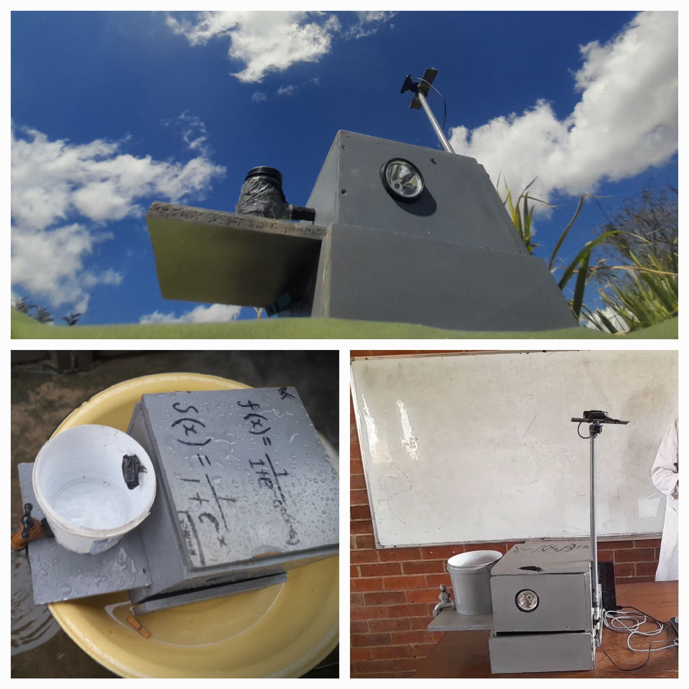

# Overview

This innovative project combines embedded systems and artificial intelligence to create a real-time flash flood forecasting device. The system uses a network of sensors to collect environmental data and processes it through a machine learning model to predict potential flash floods.

## Key Features
- Real-time flood prediction with 85% accuracy
- 30-minute early warning window
- Solar-powered operation
- Wireless sensor network
- AI-powered prediction model

# Technical Implementation

## Hardware Components
- Raspberry Pi 4 as the main processing unit
- Environmental sensors (rainfall, water level, soil moisture)
- LoRa wireless communication module
- Solar-powered battery system

## Software Architecture
The system is built with a modular architecture:
1. Data Collection Layer
2. Processing Layer
3. Prediction Layer
4. Communication Layer

## AI Model
We developed a custom TensorFlow model that processes:
- Historical weather data
- Real-time sensor readings
- Topographical information

# Results & Impact

The device successfully predicted flash floods with 85% accuracy within a 30-minute window, providing crucial early warning to communities.

## Performance Metrics
- 85% prediction accuracy
- 30-minute warning window
- 24/7 operation capability
- Low power consumption

# Gallery

## Device Overview

# Technical Challenges & Solutions

## Challenges
1. Power consumption optimization
2. Real-time data processing
3. Environmental durability

## Solutions
- Implemented efficient power management system
- Developed optimized data processing pipeline
- Used weather-resistant materials and protective casing

# Future Improvements

## Planned Enhancements
- Integration with weather APIs
- Mobile app for remote monitoring
- Enhanced prediction accuracy
- Expanded sensor network coverage

## Research Directions
- Advanced ML model optimization
- Integration with emergency response systems
- Community alert system development 